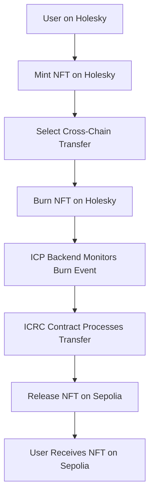

# 🌐 Cross-Chain NFT Launcher

A revolutionary cross-chain NFT platform enabling seamless NFT transfers between Ethereum networks using the power of **Internet Computer Protocol (ICP)** and **ICRC contracts**.

## 🚀 Overview

The Cross-Chain NFT Launcher allows users to mint, transfer, and bridge NFTs between different blockchain networks. Currently supporting **Holesky** and **Sepolia** testnets, with full mainnet support coming soon.

## 🔗 Smart Contract Addresses

### **Holesky Testnet**
```
Contract Address: 0x027315bad2c06b0ab2a4f31c6b4b162f798a3b31
```

### **Sepolia Testnet**
```
Contract Address: 0x800e11fb1f4c9b33eab0dd7aae19c2ae741be30c
```

### **Admin Address**
```
Admin: 0x6aa3a45c64B45BF5eb031A4Ae18059e36e674E9e
```

## 🌉 Cross-Chain Flow: Holesky → Sepolia

### **Complete Transfer Process**



### **Step-by-Step Process**

#### **1. NFT Minting**
- User connects MetaMask wallet to Holesky network
- Mints NFT with metadata (name, description, image, price)
- NFT is created on Holesky contract `0x027315bad2c06b0ab2a4f31c6b4b162f798a3b31`

#### **2. Cross-Chain Transfer Initiation**
- User selects NFT from their collection
- Chooses destination network (Sepolia)
- Initiates cross-chain transfer

#### **3. Burn Process (Source Chain)**
- Smart contract burns the NFT on Holesky
- Emits `NftBurned` event with:
  - Token ID
  - Owner address
  - NFT metadata
  - Destination chain info
  - Burn timestamp

#### **4. ICP Backend Processing**
- **ICP Backend** continuously monitors Holesky network
- Detects burn event using event logs
- Extracts NFT metadata and transfer details
- Updates block number tracking

#### **5. ICRC Contract Execution**
- **ICRC (Internet Computer Canister)** contract processes the cross-chain request
- Validates burn transaction authenticity
- Prepares mint transaction for destination chain
- Manages cross-chain state synchronization

#### **6. NFT Release (Destination Chain)**
- ICRC contract calls Sepolia NFT contract `0x800e11fb1f4c9b33eab0dd7aae19c2ae741be30c`
- Mints identical NFT with preserved metadata
- Assigns ownership to original user
- Emits `NftMinted` event on Sepolia

#### **7. Completion**
- User receives notification of successful transfer
- NFT appears in user's Sepolia wallet
- Transaction hashes provided for both chains
- Full audit trail maintained

## 🏗️ Technical Architecture

### **Frontend (React)**
- Modern Web3 interface with MetaMask integration
- Real-time NFT discovery and management
- Network-aware UI with automatic switching
- Progress tracking for cross-chain transfers

### **Backend (Rust + ICP)**
- **Internet Computer Protocol** canister
- Event monitoring and processing
- Cross-chain transaction orchestration
- **ICRC contract** integration for secure transfers

### **Smart Contracts (Solidity)**
- ERC-721 compatible NFT contracts
- Cross-chain burn/mint mechanisms
- Metadata preservation across chains
- Event emission for tracking

## ⚡ Key Features

### **🎨 NFT Management**
- **Mint NFTs** with custom metadata
- **View Collections** across all supported networks
- **Transfer NFTs** within the same network
- **Set Prices** for marketplace functionality

### **🌉 Cross-Chain Capabilities**
- **Seamless Transfers** between networks
- **Metadata Preservation** across chains
- **Real-time Monitoring** of transfer progress
- **Automatic Network Detection**

### **🔒 Security & Reliability**
- **ICRC Contract** ensures secure cross-chain operations
- **Event-based Verification** for all transactions
- **Multi-signature Support** for admin operations
- **Comprehensive Error Handling**

### **📊 User Experience**
- **Instant NFT Discovery** with caching
- **Progress Bars** for long-running operations
- **Network-specific Explorer Links**
- **Auto-refresh** on network changes

## 🔧 Development Setup

### **Prerequisites**
- Node.js 18+ and npm
- Rust and Cargo
- DFX (IC SDK)
- MetaMask browser extension

### **🔑 Admin Wallet Setup**

Before deploying, you need to generate and fund the admin wallet address that will be used by the ICRC contract for cross-chain operations:

#### **Generate Admin Address**
The ICRC contract automatically generates an Ethereum address using ECDSA key derivation:

```rust
#[update]
pub async fn generate_key_pair_evm() -> Result<String, String> {
    let (_, ecdsa_key) = get_network_config();

    let request = EcdsaPublicKeyArgument {
        key_id: EcdsaKeyId {
            curve: EcdsaCurve::Secp256k1,
            name: ecdsa_key.to_string(),
        },
        ..Default::default()
    };

    let (response,) = ecdsa_public_key(request)
        .await
        .map_err(|e| format!("ecdsa_public_key failed {:?}", e))?;

    ic_cdk::println!("ECDSA public key response: {:?}", response);

    let public_key_hex = hex::encode(&response.public_key);
    ic_cdk::println!("Derived public key hex: {}", public_key_hex);

    let ethereum_address = pubkey_bytes_to_address(&response.public_key);

    Ok(ethereum_address)
}
```

#### **Funding Required**
1. **Deploy the canister** and call `generate_key_pair_evm()`
2. **Copy the returned Ethereum address**
3. **Fund this address** with test ETH on both networks:
   - **Holesky Testnet**: Get ETH from [Holesky Faucet](https://holesky-faucet.pk910.de/)
   - **Sepolia Testnet**: Get ETH from [Sepolia Faucet](https://sepoliafaucet.com/)

> **⚠️ Important**: This address is used by the ICRC contract to execute cross-chain minting transactions. Without sufficient funds, cross-chain transfers will fail.

### **Installation**
```bash
# Clone the repository
git clone <repository-url>
cd cross_nft_launcher

# Install frontend dependencies
cd src/cross_nft_launcher_frontend
npm install

# Start local IC replica
dfx start --clean

# Deploy canisters
dfx deploy

# Start frontend development server
npm start
```

### **Environment Configuration**
```bash
# Create .env file
REACT_APP_CANISTER_ID=your-backend-canister-id
REACT_APP_ICP_NETWORK=http://127.0.0.1:4943
NODE_ENV=development
```

## 📱 Usage Guide

### **Connect Wallet**
1. Install MetaMask extension
2. Add Holesky/Sepolia networks
3. Import test accounts with ETH

### **Mint NFT**
1. Navigate to "Mint NFT" section
2. Fill in NFT details (name, description, image URL, price)
3. Confirm transaction in MetaMask
4. Wait for confirmation

### **Cross-Chain Transfer**
1. Go to "Cross-Chain Transfer" section
2. Select NFT from dropdown
3. Choose destination network
4. Confirm burn transaction
5. Monitor transfer progress
6. Verify NFT arrival on destination network

## 🔮 Future Roadmap

### **🌐 Mainnet Launch**
- **Ethereum Mainnet** integration
- **Production-ready** smart contracts
- **Enhanced security** measures
- **Gas optimization** improvements

### **🚀 Multi-Chain Expansion**
- **Solana** network integration
- **Stellar** blockchain support
- **Additional EVM** compatible chains
- **Cross-ecosystem** NFT bridges

### **⚡ Advanced Features**
- **Batch Transfers** for multiple NFTs
- **Automated Market Making** integration
- **Fractional NFT** support
- **Governance Token** implementation

---

## 🎯 **Coming Soon: Mainnet Launch!**

> **🚨 MAJOR ANNOUNCEMENT 🚨**
>
> **Cross-Chain NFT Launcher** will soon go live on **Ethereum Mainnet** with full production capabilities!
>
> ### **What's Coming:**
> - ✅ **Full Mainnet Support** - Ethereum, Polygon, Arbitrum
> - ✅ **ICRC Contract Integration** - Leveraging complete power of Internet Computer
> - ✅ **Multi-Blockchain Support** - Solana, Stellar, and more EVM chains
> - ✅ **Enterprise-Grade Security** - Audited smart contracts and battle-tested infrastructure
> - ✅ **Advanced NFT Features** - Royalties, batch operations, and marketplace integration
>
> ### **Powered by Internet Computer Protocol**
> Our **ICRC contracts** provide unprecedented security and reliability for cross-chain operations, making us the most trusted cross-chain NFT platform in the ecosystem.
>
> **Stay tuned for the official mainnet launch! 🎉**

---

## 📄 License

This project is licensed under the MIT License - see the [LICENSE](LICENSE) file for details.

## 🤝 Contributing

We welcome contributions! Please see our [Contributing Guidelines](CONTRIBUTING.md) for details.

## 📞 Support

- **Discord**: [Join our community](https://discord.gg/crosschain-nft)
- **Twitter**: [@CrossChainNFT](https://twitter.com/crosschainnft)
- **Email**: support@crosschainnft.io

---

**Built with ❤️ using Internet Computer Protocol and the power of decentralized cross-chain technology.**

To learn more before you start working with `cross_nft_launcher`, see the following documentation available online:

- [Quick Start](https://internetcomputer.org/docs/current/developer-docs/setup/deploy-locally)
- [SDK Developer Tools](https://internetcomputer.org/docs/current/developer-docs/setup/install)
- [Rust Canister Development Guide](https://internetcomputer.org/docs/current/developer-docs/backend/rust/)
- [ic-cdk](https://docs.rs/ic-cdk)
- [ic-cdk-macros](https://docs.rs/ic-cdk-macros)
- [Candid Introduction](https://internetcomputer.org/docs/current/developer-docs/backend/candid/)

If you want to start working on your project right away, you might want to try the following commands:

```bash
cd cross_nft_launcher/
dfx help
dfx canister --help
```

## Running the project locally

If you want to test your project locally, you can use the following commands:

```bash
# Starts the replica, running in the background
dfx start --background

# Deploys your canisters to the replica and generates your candid interface
dfx deploy
```

Once the job completes, your application will be available at `http://localhost:4943?canisterId={asset_canister_id}`.

If you have made changes to your backend canister, you can generate a new candid interface with

```bash
npm run generate
```

at any time. This is recommended before starting the frontend development server, and will be run automatically any time you run `dfx deploy`.

If you are making frontend changes, you can start a development server with

```bash
npm start
```

Which will start a server at `http://localhost:8080`, proxying API requests to the replica at port 4943.

### Note on frontend environment variables

If you are hosting frontend code somewhere without using DFX, you may need to make one of the following adjustments to ensure your project does not fetch the root key in production:

- set`DFX_NETWORK` to `ic` if you are using Webpack
- use your own preferred method to replace `process.env.DFX_NETWORK` in the autogenerated declarations
  - Setting `canisters -> {asset_canister_id} -> declarations -> env_override to a string` in `dfx.json` will replace `process.env.DFX_NETWORK` with the string in the autogenerated declarations
- Write your own `createActor` constructor
